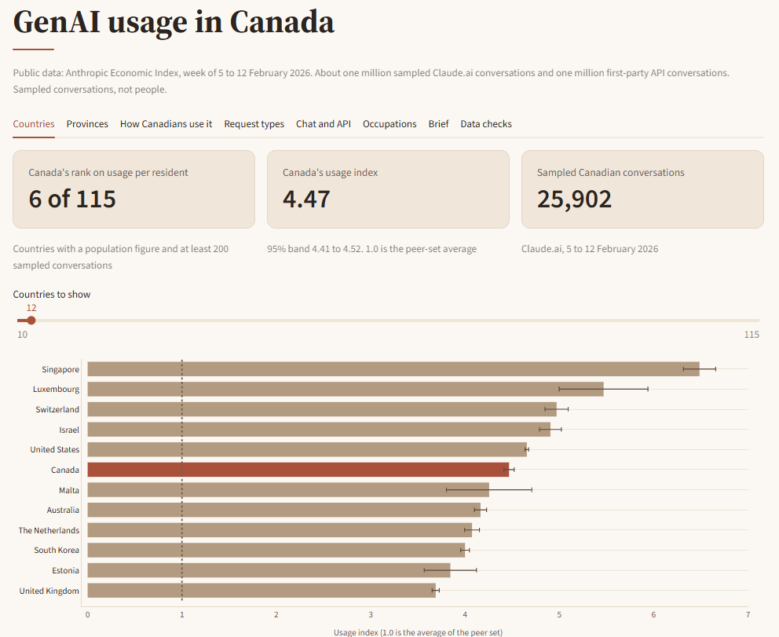
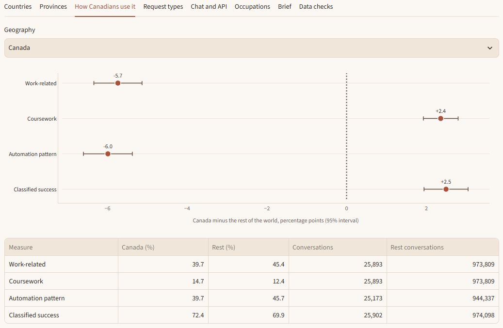
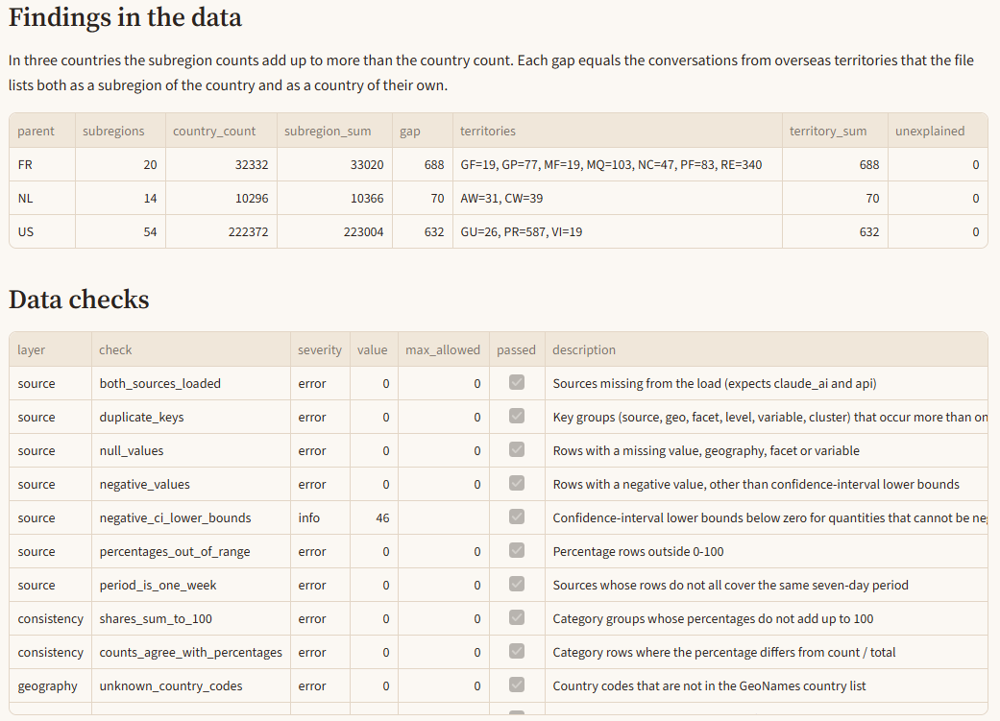
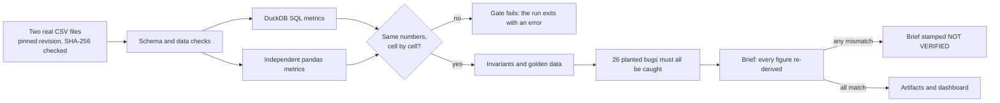

# AdoptionLens

[](https://github.com/Randeep-Sidhu/Adoption-lens/actions/workflows/ci.yml)

<!-- After deploying the dashboard, add a line here: **Live demo:** [your-app.streamlit.app](https://your-app.streamlit.app) -->

A dashboard is easy to believe and hard to check. This project puts the checking first. It measures how Canada uses generative AI compared with the rest of the world, on real data, and every number it publishes has been computed twice, compared with answers worked out by hand, and tested against bugs I planted on purpose.

The data is Anthropic's public Economic Index: a one-week sample of about a million Claude.ai conversations and a million first-party API conversations from February 2026, 620,413 rows in all. The questions are the ones an adoption team would ask. How much do Canadians use it, and where in Canada? What for, and how does that differ from everyone else? How does chat use differ from API use? Which occupations are most exposed?

There are five pieces. A SQL metric layer in DuckDB produces every figure. An independent pandas implementation, written from the written definitions rather than from the SQL, recomputes all of them. A small hand-built dataset carries answers I worked out on paper. Twenty-six planted bugs test whether those checks can notice a mistake at all. A written brief refuses to publish any figure it cannot re-derive, and a Streamlit dashboard sits on top.

I built it to practise the part of analytics work that comes after the query runs: writing metric definitions down, making a second implementation disagree with the first on purpose, and not publishing a number I cannot re-derive. The data is public and covers one AI product, not any organisation's internal usage. The unit throughout is a sampled conversation, not a person.

## Screenshots



*Countries. Canada is highlighted; the bars show 95% bands.*



*How Canadians use it. The gap between Canada and the rest of the world, in percentage points, with the counts behind it.*



*Data checks. The dashboard shows its own evidence: the gaps I found in the data and the checks that ran on it.*

## What I found

Week of 5 to 12 February 2026, intervals at 95%. Every figure here is in [`artifacts/brief.md`](artifacts/brief.md), and each was re-derived by the second implementation before it was written.

**Canada is a high-use market.** Its 25,902 sampled conversations put it 6th of 115 countries on usage per resident. The usage index is 4.47 (band 4.41 to 4.52), where 1.0 is the pooled average of the countries compared. Singapore is first at 6.49 and the United States is at 4.66.

**Use varies a lot inside Canada.** British Columbia is at 1.36 and Saskatchewan at 0.36, which is 3.8 times lower, and their bands do not overlap.

**Canadians use it less for work.** 39.7% of Canadian conversations are work-related against 45.4% elsewhere, which is 5.7 points lower (interval 5.1 to 6.3). Coursework is 2.4 points higher, and the pattern where a person delegates a task and reviews the result is less common (39.7% against 45.7%). Compared with the rest of the world, Canadians ask more about job applications (1.37 times the share, band 1.30 to 1.45) and about financial and tax questions (1.20), and less about entertainment and sports (0.49).

**Chat and API are different things to measure.** 74.2% of API conversations are work-related against 45.2% in chat, and the classifier marks 50.5% of them successful against 69.9%.

**Exposure differs by occupation group.** Business and Financial Operations ranks 5th of 22 groups on mean observed exposure (0.177); Computer and Mathematical is first (0.379).

None of this is causal, and one week cannot show change. What it does show is where the differences are and how large they are next to sampling error. Where the brief speculates about what an internal rollout should do with these results, it says that it is a hypothesis to test, not a finding.

## How I know the numbers are right

Every metric exists twice. The SQL in `adoption_lens/sql/` produces the outputs. A separate pandas implementation, written from [`docs/metric_dictionary.md`](docs/metric_dictionary.md) rather than from the SQL, recomputes everything, and the two are compared cell by cell: 55,309 cells, no differences.

Two implementations written by the same person can share a misunderstanding, so there are more layers. A hand-built dataset in `golden.py` has expected values worked out on paper, and each of its geographies exists to trigger one rule: a country with no population, a state that is nearly all of its country, a tie in a ranking. Eighteen invariants check things that must hold whatever the data is, for example that the population-weighted usage index averages exactly 1 within its peer set. Twenty data checks run on the source files before any of that.

Then comes the test of the tests. I break the SQL on purpose, one small change at a time, the kind of mistake that happens in real work: a confidence interval using z = 1.645 instead of 1.96, unclassified conversations counted as a place, a comparison group that still contains the geography it is being compared with. Each of the 26 has to be caught.

| Check | Planted bugs caught, out of 26 |
|---|---|
| Independent implementation (real and golden data) | 26 |
| Hand-computed golden values | 26 |
| Invariants (real and golden data) | 6 |
| Real data alone, any check | 25 |

The one the real data misses swaps `RANK` for `DENSE_RANK` in the occupation ranking. It goes unnoticed because no two occupation groups tie in the real file; the golden data has a tie on purpose and catches it. That is the case for the golden data: which bugs a real dataset happens to expose depends on the dataset. [`docs/qa_strategy.md`](docs/qa_strategy.md) lists all 26.

## Things I ran into

**Subregions that add up to too much.** In France, the Netherlands and the US the subregion counts exceed the country count, by 688, 70 and 632 conversations. Each gap equals exactly the overseas territories (Guadeloupe, Martinique, Puerto Rico, Aruba and others) that the file lists both as a subregion and as a country of their own. The data check compares the gap with a territory table, so a new discrepancy would fail instead of being waved through.

**A population column eight years out of date.** My first country populations came from GeoNames and put Canada at 37.1 million. The World Bank's 2024 figure is 41.3 million. Switching moved Canada's usage index from 4.62 to 4.47 and left its rank at 6th. Taiwan and Réunion have no World Bank figure, so they are out of the index, and a data check reports that.

**A comparison group with almost nothing in it.** Drilling into one planted bug showed subregions that make up nearly all of their country, leaving a handful of conversations to compare against. Requiring at least 200 conversations in the comparison group removed 155 of 2,141 comparisons.

**Missing countries and impossible numbers.** 18.4% of sampled Claude.ai conversations have no usable country. They stay out of every geography metric and remain in "rest of world". Namibia's country code is `NA`, which a default CSV reader turns into a missing value, so the loader switches that off and a test covers it. 46 confidence-interval lower bounds in the API file are negative for quantities such as hours; that is ordinary bootstrap behaviour near zero, nothing here uses those columns, and it is reported as information.

## How it works



The downloads are pinned to a Hugging Face revision and verified by SHA-256, and the raw files are not committed. A full run takes about 30 seconds. Everything the dashboard reads is written to `artifacts/`, so the app needs no raw data.

## Decisions and trade-offs

**The SQL ships; the pandas version is the referee.** The two share nothing but the definitions. When they disagree, the run fails, and the [`investigate`](adoption_lens/investigate.py) tool shows which cells moved and by how much.

**Definitions live in one document, and a test keeps them honest.** Thresholds, formulas and category lists are written in `docs/metric_dictionary.md`. A test fails if the SQL, the configuration and the document stop agreeing.

**Small samples are guarded, not hidden.** A geography needs 200 conversations to appear, a request category needs 30, and a comparison group needs 200. Shares carry Wilson intervals, differences carry Wald intervals, and location quotients carry log-ratio intervals, so a wide band is visible on the chart instead of implied.

**The brief can refuse to publish.** If any of its 53 figures disagrees with the second implementation, it is stamped NOT VERIFIED and says not to use it. A test breaks the SQL and confirms that it does.

**Judgement calls are labelled as judgement.** The four request categories I treat as close to financial services work are a list I chose, kept in `data/reference/finance_lens.csv`. Exposure is an unweighted mean across occupations. Both are stated where the numbers appear.

**Test data that can run anywhere.** The full files are 140 MB, so CI runs against a slice of real rows and finishes in about a minute. The six tests that need the full files skip cleanly without them.

**The dashboard shows its own evidence.** The Data checks tab lists the reconciliation count, the invariants, the data checks and the planted bugs, so a reader can see the checks instead of taking my word for them.

## Running it

```bash
git clone https://github.com/Randeep-Sidhu/Adoption-lens.git
cd Adoption-lens
python -m venv .venv
.venv\Scripts\activate            # macOS and Linux: source .venv/bin/activate
pip install -r requirements.txt

python -m adoption_lens.fetch     # downloads the two source files (about 140 MB) and checks their SHA-256
python -m adoption_lens.pipeline  # about 30 seconds: metrics, every check, the brief, artifacts/
python -m pytest -q               # 135 tests; 129 run without the download
streamlit run streamlit_app.py
```

To follow up on a finding or a planted bug:

```bash
python -m adoption_lens.investigate rollup   # why three countries' subregions over-count
python -m adoption_lens.investigate M14      # re-run one planted bug and see which check caught it
```

## Repository layout

```
adoption_lens/
  sql/                 Metric layer: eight DuckDB files
  reference.py         Independent pandas implementation
  golden.py            Hand-built dataset and its expected values
  mutants.py           The 26 planted bugs
  dq.py                Data checks
  compare.py           Reconciliation and invariants
  readout.py           The brief and its figure verification
  fetch.py             Pinned, checksum-verified download
  pipeline.py          Full run: metrics, every check, artifacts
  investigate.py       Drill into a data finding or a planted bug
  config.py, data.py, warehouse.py    Settings, loading, DuckDB wrapper
streamlit_app.py       The dashboard
artifacts/             Output of the last pipeline run: metric tables, brief, QA results
data/reference/        Small reference tables, sourced in docs/data_sources.md
docs/                  Metric dictionary, QA strategy, data sources, screenshots
tests/                 135 tests; the six that need the full download skip without it
```

## Limitations

- One week of data, so nothing here shows change over time.
- Conversations are sampled and labelled by a model. "Success" is a classifier label, not an outcome anyone reported.
- The second implementation was written by the same person as the SQL, so both could share a misunderstanding of a definition. The golden data and the invariants are there to reduce that risk, not to remove it.
- The usage index uses total population. Anthropic's own index uses working-age population, so the numbers are not comparable with theirs.
- Country populations are for 2024 and provincial ones for April 2026. The two are indexed in separate peer sets and should not be compared with each other.
- Taiwan and Réunion are left out of the usage index because they have no World Bank population figure.
- The finance-related request categories are a list I chose.
- This covers Claude only and says nothing about other tools.

## What I would do next

Add further weekly releases so the dashboard can show change over time; the schema check would make a changed file layout fail loudly instead of quietly. Use working-age denominators so the index can be compared with Anthropic's own. Weight exposure by employment using Canadian labour-force data. Apply the same checking approach to product event data such as activation and time to value; I have not built that here, and I kept this project to data anyone can download and verify.

## Data and credits

Usage and exposure data: Anthropic Economic Index, released by Anthropic under CC-BY. Massenkoff, Lyubich, McCrory, Appel and Heller (2026), *Anthropic Economic Index report: Learning curves*. Populations: World Bank and Statistics Canada. Country names and codes: GeoNames (CC BY 4.0). Details and licences are in [`docs/data_sources.md`](docs/data_sources.md). This is an independent portfolio project and is not affiliated with or endorsed by Anthropic. Code is MIT licensed.
